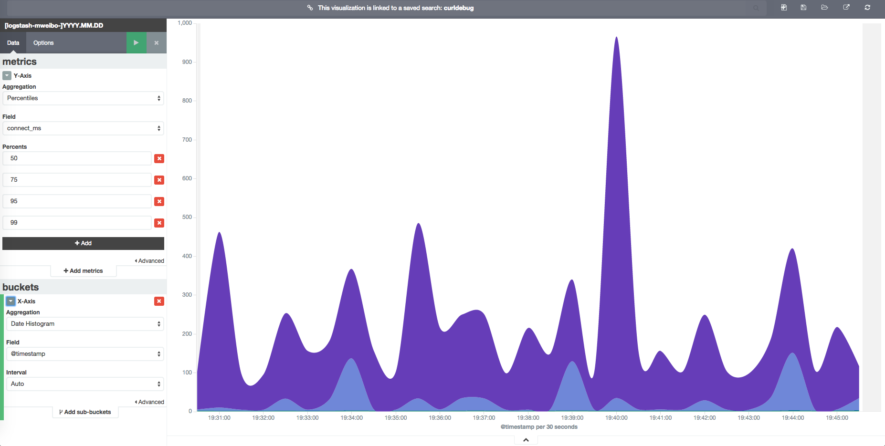

# 响应时间的百分占比趋势图

时序图除了上节展示的最基本的计数以外，还可以在 Y 轴上使用其他数值统计结果。最常见的，比如访问日志的平均响应时间。但是平均值在数学统计中，是一个非常不可信的数据。稍微几个远离置信区间的数值就可以严重影响到平均值。所以，在评价数值的总体分布情况时，更推荐采用四分位数。也就是 25%，50%，75%。在可视化方面，一般采用箱体图方式。

Kibana4 没有箱体图的可视化方式。不过采用线图，我们一样可以做到类似的效果。

在上一章的时序数据基础上，改变 Y 轴数据源，选择 Percentile 方式，然后输入具体的四分位。运行渲染即可。



对比新的 URL，可以发现变化的就是 id 为 1 的片段。变成了 `(id:'1',params:(field:connect_ms,percents:!(50,75,95,99)),schema:metric,type:percentiles)`：

```
http://k4domain:5601/#/visualize/create?type=area&savedSearchId=curldebug&_g=()&_a=(filters:!(),linked:!t,query:(query_string:(query:'*')),vis:(aggs:!((id:'1',params:(field:connect_ms,percents:!(50,75,95,99)),schema:metric,type:percentiles),(id:'2',params:(customInterval:'2h',extended_bounds:(),field:'@timestamp',interval:auto,min_doc_count:1),schema:segment,type:date_histogram)),listeners:(),params:(addLegend:!f,addTimeMarker:!f,addTooltip:!t,defaultYExtents:!f,interpolate:linear,mode:stacked,scale:linear,setYExtents:!f,shareYAxis:!t,smoothLines:!t,times:!(),yAxis:()),type:area))
```

实践表明，在访问日志数据上，平均数一般相近于 75% 的四分位数。所以，为了更细化性能情况，我们可以改用诸如 90%，95% 这样的百分位。

此外，从 Kibana4.1 开始，新加入了 *Percentile_rank* 聚合支持。可以在 Y 轴数据源里选择这种聚合，输入具体的响应时间，比如 2s。则可视化数据变成 2s 内完成的响应数占总数的百分比的趋势图。
